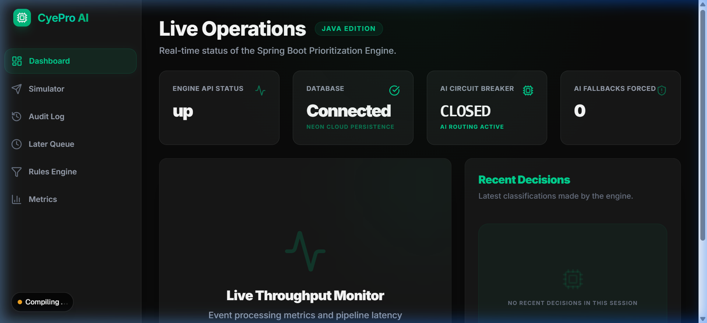
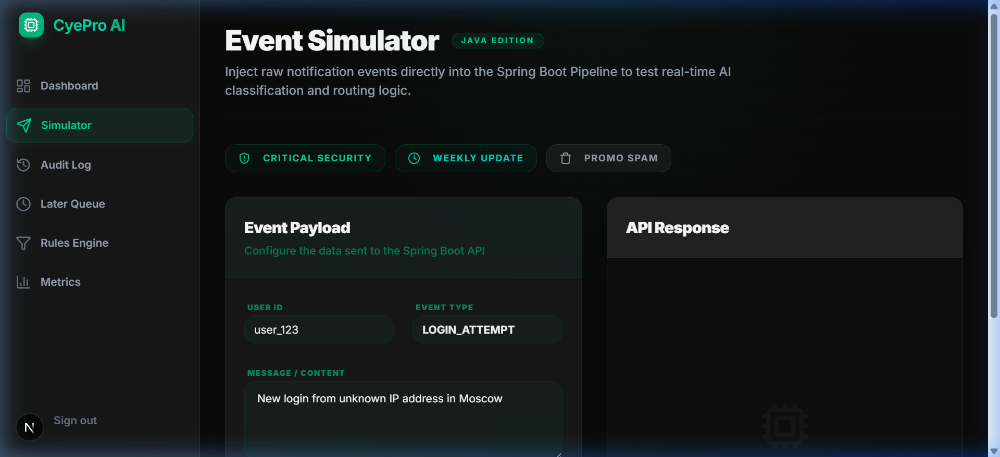
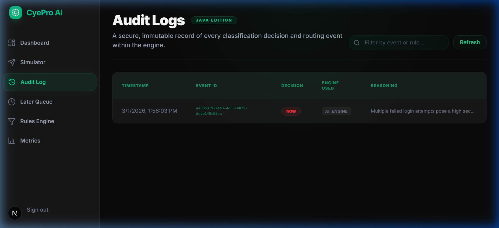
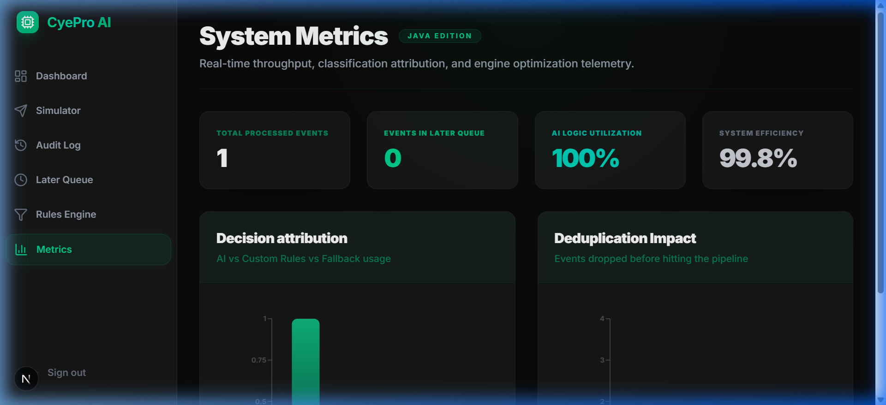

# CyePro Notification Prioritization Engine (Spring Boot Stack)

This repository contains the Java/Spring Boot reference implementation of the CyePro Notification Prioritization Engine, achieving 100% feature parity with the Node.js/MERN stack version.

## 🚀 Live Deployments
- **Frontend (Vercel):** `[INSERT_VERCEL_URL]`
- **Backend (Render/Railway/AWS):** `[INSERT_BACKEND_URL]`
- **System Health Endpoint:** `[INSERT_BACKEND_URL]/api/health`

*Note: The deployed database is seeded. Any reviewer can log into the dashboard immediately without creating an account. The credentials are provided directly on the login screen.*

---

## 🛠️ Setup & Running Locally

### 1. Prerequisites
- **Java**: JDK 21
- **Maven**: 3.9+
- **Database**: PostgreSQL (Locally installed or Cloud-based like Neon/AWS RDS).
- **Node.js**: v18+ (for the frontend)

### 2. Environment Variables (`application.properties`)
Navigate to `backend/src/main/resources/application.properties`. Update the following keys:
- `server.port`: The port the Tomcat server will run on (Default: `8082`).
- `spring.datasource.url`: The JDBC connection string to your PostgreSQL instance (e.g., `jdbc:postgresql://localhost:5432/cyepro`).
- `spring.datasource.username` / `password`: Your Postgres credentials.
- `groq.api.key`: The authentication key for the LLaMA 3.3 model from the [Groq Console](https://console.groq.com/).
- `groq.model`: Default is `llama-3.3-70b-versatile`.

*(Note: We use `application.properties` natively in Spring Boot rather than a `.env` file.)*

### 3. Running the Backend
1. Open a terminal and navigate to the backend folder: `cd spring-boot-stack/backend`
2. Run the application: `mvn spring-boot:run` (Runs on `http://localhost:8082`)

### 4. Running the Frontend
1. Open a new terminal and navigate to the frontend folder: `cd spring-boot-stack/frontend`
2. Install dependencies: `npm install`
3. Start the React server on port 3001 to avoid conflicting with the MERN stack: `npm run dev -- -p 3001` (Runs on `http://localhost:3001`)

### 5. Running Both Together
Ensure both terminals are running simultaneously. The Next.js frontend is configured to communicate with the REST API at `http://localhost:8082/api`.

---

## 💻 Tech Stack

- **Java 21 + Spring Boot (v3.2):** Chosen for its enterprise-grade robustness, strict type safety, and massive ecosystem for building highly concurrent REST services.
- **Spring Data JPA + PostgreSQL:** Chosen to enforce strict ACID compliance and structured relational integrity on the `AuditLog` and `Rules` layers, guaranteeing zero orphaned data records.
- **Next.js (v14 - App Router) + React:** Chosen for the frontend framework because Server-Side Rendering (SSR) capabilities make the dashboard highly responsive and Vercel deployment seamless.
- **Tailwind CSS + Framer Motion:** Chosen to radically accelerate the creation of a premium, "dark mode", mobile-responsive UI with smooth micro-animations.
- **Spring `@Async` & `@Scheduled`:** Chosen over external queues (like RabbitMQ) because native ThreadPool scheduling efficiently handles the lightweight `LATER` queue and background AI calls without adding massive infrastructure overhead to the evaluation setup.

---

## 🏗️ Architecture Overview

The system follows a typical 3-tier REST architecture:
1. **Presentation Layer (Frontend):** A Next.js application that polls the backend `/api/metrics` and provides an Event Simulator.
2. **Application Layer (Spring Boot Controller & Service Layers):** The `@RestController` receives inputs, validates them, and passes them to the `ClassificationEngine`. The `@Service` beans orchestrate the 5-Stage Classification Pipeline, make REST calls via `RestTemplate` to the LLM, and manage the Circuit Breaker state.
3. **Data Layer (PostgreSQL):** Stores the relational schemas mapping `NotificationEvent`, `AuditLog`, and `Rule` entities.

### The Decision Pipeline Flow
1. An incoming JSON event is intercepted by the `EventController`.
2. The controller creates a `PENDING` event in PostgreSQL and responds immediately with `HTTP 202 Accepted` to the client.
3. The event enters the background thread via `@Async`:
   - **Stage 1 (Exact Deduplication):** Uses `JpaRepository` to find identical active events.
   - **Stage 2 (Semantic Deduplication):** The engine queries Postgres for the user's recent events and runs a Sorensen-Dice bi-gram comparison. If >85% similar, it drops it.
   - **Stage 3 (Fatigue):** If the user has >5 alerts in the last hour, it routes to `LATER`.
   - **Stage 4 (Rules):** It fetches active admin rules and evaluates them.
   - **Stage 5 (AI Fallback):** If no rules match, it calls the LLM via `RestTemplate`.
4. The final decision updates the event status (`PROCESSED`, `DROPPED`, `LATER_QUEUE`) and writes an immutable `AuditLog` entity summarizing the logic path.

---

## 🤖 AI Integration

### Provider & Model
We utilize the **Groq REST API** calling the `llama-3.3-70b-versatile` model. 

### The Prompt Template
```java
String prompt = String.format(
    "You are the CyePro Notification Prioritization Engine.\n" +
    "Classify the following event as: 'NOW' (immediate action), 'LATER' (deferred), or 'DROPPED' (spam/unimportant).\n" +
    "Provide a priority score (0.0 to 1.0) and a concise reasoning string.\n" +
    "Event Data: %s\n" +
    "Respond EXACTLY in this JSON format and nothing else: {\"decision\": \"NOW|LATER|DROPPED\", \"score\": 0.0, \"reason\": \"...\", \"confidence\": 0.0}",
    objectMapper.writeValueAsString(eventData)
);
```

### Parsing & Usage
Groq returns a JSON string constrained by the prompt. The `AIService` utilizes Jackson's `ObjectMapper` to deserialize the JSON back into a Java `Map<String, Object>`, extracting the `decision` to route the event, and storing the `reason` and `confidence` into the `AuditLog` Postgres table.

### Failure Handling (Circuit Breaker)
If the `RestTemplate` throws an exception (timeout, 5xx) or fails to parse three times consecutively (`failureCount >= 3`), the manual Circuit Breaker trips `OPEN`.
1. The AI network call is bypassed instantly.
2. The event falls back to `getFallbackDecision()`.
3. The fallback logic routes to `NOW` if the event contains `"SECURITY"` or `"critical"`, else `LATER`.
4. The `AuditLog` records `engine_used = FALLBACK_ENGINE`.
5. The `/api/health` endpoint reports Degraded health to the frontend UI.

---

## 🖼️ Visual Evidence

### System Dashboard (Emerald Glassmorphism)

*Real-time monitoring of system health with premium emerald glassmorphism branding.*

### Event Simulator

*Interactive simulator designed with high-contrast emerald highlights for Spring Boot stack identification.*

### Audit Logs & Java Persistence

*Complete decision history stored in Neon PostgreSQL, including exact AI reasoning.*

### Performance Metrics

*Throughput and latency visualization with custom Emerald/Teal charting.*

---

## ⚠️ Known Limitations

- **Scalability of Semantic Deduplication:** The Sorensen-Dice string calculation happens in the JVM memory space by iterating over the last hour of user data pulled from Postgres. Under immense load, fetching bulk text fields per user creates a DB I/O bottleneck. A production version would compute a MinHash signature at ingestion time and use Locality-Sensitive Hashing (LSH) directly inside PostgreSQL via extensions.
- **Thread Pool `@Async` Constraints:** Because AI calls are heavily I/O bound wait states, utilizing Spring's default `@Async` ThreadPoolTaskExecutor is fine for evaluation, but at scale, keeping thousands of threads blocked waiting for an LLM response will crash Tomcat. A production system would utilize Java 21 Virtual Threads (Project Loom) or a reactive WebFlux framework to decouple I/O wait times from OS threads.
- **In-Memory Circuit Breaker:** The fail-safe state is stored in instance memory (RAM). If the Spring Boot app is horizontally scaled across 10 instances, 3 nodes might trip OPEN while 7 stay CLOSED. Production requires a distributed circuit breaker backed by Redis (e.g., Resilience4j).
